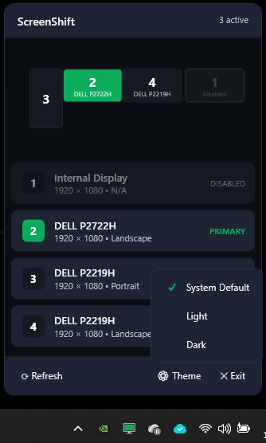

# ScreenShift

A simple Windows 11 app to quickly change your primary monitor from the system tray.

## Screenshot

<p align="center">
  
</p>

## Features
- System tray app - always accessible
- Lists all connected monitors with resolution and orientation
- One-click to set any monitor as primary
- Light/Dark theme support (follows system or manual)
- Start with Windows option
- Modern Windows 11 style UI

## Requirements
- Windows 10/11 (version 1809+)
- .NET 10.0

## Installation

Install from the [Microsoft Store](https://apps.microsoft.com/detail/9N0JFMK5BGPG) or build from source.

## Build from Source

```bash
dotnet build src/ScreenShift/ScreenShift.csproj
dotnet run --project src/ScreenShift/ScreenShift.csproj
```

## Usage
1. Click the tray icon to open the popup
2. Click on any monitor to set it as primary
3. Use the Theme button to switch themes
4. Enable "Start with Windows" to auto-launch on login

## License
MIT
